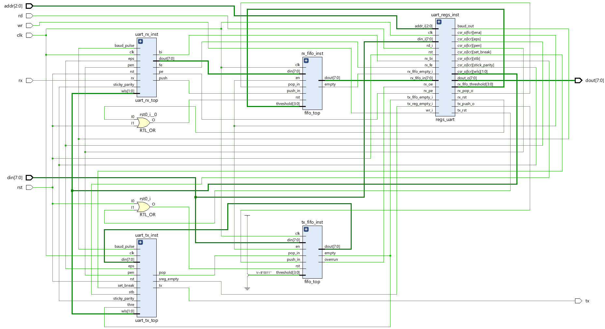

# UART 16550 SystemVerilog

A SystemVerilog implementation of a 16550-style UART subsystem with programmable baud generation, line-format configuration, separate transmit and receive datapaths, 16-entry FIFOs, status registers, and a verbose verification testbench.

The design models the central behavior of a classic UART: a parallel host interface writes bytes into a transmit FIFO, the transmitter serializes those bytes onto `tx`, the receiver samples serial data from `rx`, and received bytes are stored in a receive FIFO for host reads. The testbench exercises multiple baud-rate and frame-format combinations and captures console logs, waveforms, and a schematic.



## Project Highlights

- 16550-inspired register interface with DLAB-controlled divisor latch access.
- Programmable frame format through the Line Control Register:
  - 5, 6, 7, or 8 data bits.
  - 1, 1.5, or 2 stop-bit timing.
  - Odd, even, mark, and space parity modes.
  - Break-control support on the transmit line.
- Baud pulse generation from a 16-bit divisor latch.
- Independent TX and RX state machines.
- Separate 16-entry TX and RX FIFO instances.
- Line Status Register updates for data-ready, overrun, parity, framing, break, THR-empty, and transmitter-empty status.
- Verification artifacts for four UART configurations.

## Repository Structure

```text
.
|-- design.sv
|-- tb.sv
|-- README.md
|-- docs/
|   `-- PROJECT_DOCUMENTATION.md
|-- Schematic/
|   `-- Schematic.png
|-- Waveform/
|   `-- Baud9600_OddParity_8bit_1StopBit/
|       |-- Baud_generation.png
|       |-- CSR_register_BaudPulse.png
|       |-- Receiver_FIFO.png
|       |-- Transmitter_FIFO.png
|       |-- UART_Receiver.png
|       `-- UART_Transmitter.png
`-- Console Output/
    |-- Baud9600_OddParity_8bit_1StopBit/
    |-- Baud19200_EvenParity_7bit_2Stopbit/
    |-- Baud38400_StickyParity0_5bit_1.5StopBit/
    `-- Baud9600_StickyParity1_6bit_1StopBit/
```

## Top-Level Interface

The top-level RTL module is `all_mod` in `design.sv`.

| Signal | Direction | Width | Description |
| --- | --- | ---: | --- |
| `clk` | input | 1 | System clock. The testbench uses a 10 ns period. |
| `rst` | input | 1 | Active-high reset. |
| `wr` | input | 1 | Host write strobe. |
| `rd` | input | 1 | Host read strobe. |
| `rx` | input | 1 | Serial receive input. Idle level is high. |
| `addr` | input | 3 | Register address bus. |
| `din` | input | 8 | Host write data bus. |
| `tx` | output | 1 | Serial transmit output. Idle level is high. |
| `dout` | output | 8 | Host read data bus. |

## Internal Modules

| Module | Purpose |
| --- | --- |
| `all_mod` | Integrates register block, baud pulse, TX FIFO, RX FIFO, transmitter, and receiver. |
| `regs_uart` | Implements UART control/status registers, divisor latch, FIFO control, baud counter, and host read/write decode. |
| `uart_tx_top` | Transmit state machine. It pops bytes from the TX FIFO and emits start, data, optional parity, and stop bits. |
| `uart_rx_top` | Receive state machine. It detects a serial frame, samples data bits, checks parity/framing, and pushes bytes into the RX FIFO. |
| `fifo_top` | Shared 16-entry FIFO used for both TX and RX buffering. |

## Register Map

The design uses a 3-bit address bus. Register behavior changes for addresses `0` and `1` when `LCR[7]`, the Divisor Latch Access Bit (`DLAB`), is set.

| Address | `DLAB=0` | `DLAB=1` | Access Notes |
| ---: | --- | --- | --- |
| `0x0` | THR write / RHR read | Divisor Latch LSB | TX FIFO push on write when `DLAB=0`; RX FIFO pop on read when `DLAB=0`. |
| `0x1` | IER placeholder | Divisor Latch MSB | IER currently reads as `0`. |
| `0x2` | IIR placeholder / FCR write | IIR placeholder | FCR controls FIFO enable, FIFO reset pulses, DMA bit, and RX threshold. |
| `0x3` | LCR | LCR | Data length, stop bits, parity, break, and DLAB. |
| `0x4` | MCR placeholder | MCR placeholder | Currently reads as `0`. |
| `0x5` | LSR | LSR | Data-ready and error/status bits. |
| `0x6` | MSR placeholder | MSR placeholder | Currently reads as `0`. |
| `0x7` | SCR | SCR | Scratch register. |

## Baud Generation

The baud pulse is generated inside `regs_uart` from the divisor latch:

```text
baud = input_clock / (divisor_latch * 16)
```

With the testbench clock of 100 MHz:

| Target Mode | Divisor Latch | Captured Baud |
| --- | ---: | ---: |
| 9600 baud | 651 | 9600 Hz |
| 19200 baud | 326 | 19171 Hz |
| 38400 baud | 163 | 38343 Hz |

The transmitter and receiver both advance on `baud_pulse`; each UART bit is held/sampled over 16 baud-pulse ticks to model 16x UART timing.

## Verified Simulation Results

The stored console screenshots show successful transmission and reception with zero reported parity, framing, or break errors.

| Result Folder | Frame Configuration | Divisor | Captured Payload / RX FIFO Contents | Error Count |
| --- | --- | ---: | --- | ---: |
| `Baud9600_OddParity_8bit_1StopBit` | 9600 baud, odd parity, 8 data bits, 1 stop bit | 651 | `227, 11, 212, 246, 197, 193, 67, 168` | 0 |
| `Baud19200_EvenParity_7bit_2Stopbit` | 19200 baud, even parity, 7 data bits, 2 stop bits | 326 | `105, 33, 15, 97, 24, 84, 17, 0` | 0 |
| `Baud38400_StickyParity0_5bit_1.5StopBit` | 38400 baud, space/sticky-0 parity, 5 data bits, 1.5 stop bits | 163 | `3, 11, 20, 22, 5, 1, 3, 8` | 0 |
| `Baud9600_StickyParity1_6bit_1StopBit` | 9600 baud, mark/sticky-1 parity, 6 data bits, 1 stop bit | 651 | `35, 11, 20, 54, 5, 1, 3, 40` | 0 |

Waveforms for the 9600 baud odd-parity run are included:

- [Baud generation](Waveform/Baud9600_OddParity_8bit_1StopBit/Baud_generation.png)
- [CSR and baud pulse](Waveform/Baud9600_OddParity_8bit_1StopBit/CSR_register_BaudPulse.png)
- [Transmitter FIFO](Waveform/Baud9600_OddParity_8bit_1StopBit/Transmitter_FIFO.png)
- [UART transmitter](Waveform/Baud9600_OddParity_8bit_1StopBit/UART_Transmitter.png)
- [UART receiver](Waveform/Baud9600_OddParity_8bit_1StopBit/UART_Receiver.png)
- [Receiver FIFO](Waveform/Baud9600_OddParity_8bit_1StopBit/Receiver_FIFO.png)

## Testbench Flow

`tb.sv` performs the following sequence:

1. Resets the design.
2. Enables `DLAB` through the Line Control Register.
3. Writes the baud divisor latch.
4. Reprograms the LCR for the selected data format.
5. Enables the FIFO Control Register.
6. Writes eight random/data-constrained bytes into the TX FIFO.
7. Waits for TX FIFO pop events and reports each transmitted byte and parity bit.
8. Drives the `rx` input with matching UART frames using `send_uart_byte`.
9. Reports each received byte.
10. Prints RX FIFO memory contents and final error count.

## Example Simulation Commands

Use any simulator with SystemVerilog support. For example, with Questa/ModelSim:

```sh
vlog -sv design.sv tb.sv
vsim -c all_mod_tb -do "run -all; quit"
```

With Synopsys VCS:

```sh
vcs -sverilog design.sv tb.sv -o simv
./simv
```

The provided screenshots appear to come from a GUI simulator flow, so exact waveform viewing commands may differ by tool.

## Documentation

For a deeper walkthrough of the architecture, state machines, register fields, FIFO behavior, testbench methodology, and implementation notes, see:

[docs/PROJECT_DOCUMENTATION.md](docs/PROJECT_DOCUMENTATION.md)

## Implementation Notes

- The design focuses on the UART core datapath and key 16550-style registers. IER, IIR, MCR, and MSR are placeholders.
- FIFO enable is stored in FCR, but the shared FIFO module currently accepts pushes/pops independently of the `en` input.
- The TX FIFO is treated as full at count `15`, so it behaves as a 15-byte usable FIFO even though memory has 16 entries.
- In `all_mod`, the LSR overrun input is currently connected to the TX FIFO overrun signal rather than the RX FIFO overrun signal. For strict 16550 behavior, RX overrun should drive `LSR[1]`.
- The current testbench is excellent for demonstration and waveform inspection. For regression use, the printed checks can be strengthened into assertions or scoreboard comparisons.

## GitHub Upload

From this folder:

```sh
git init
git add .
git commit -m "Add UART 16550 RTL project"
git branch -M main
git remote add origin https://github.com/<your-username>/<your-repo>.git
git push -u origin main
```

Replace `<your-username>` and `<your-repo>` with your GitHub account and repository name.
